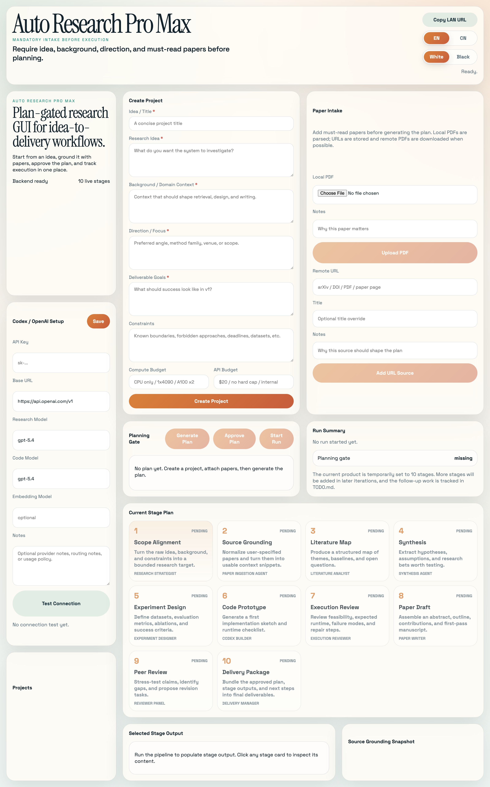
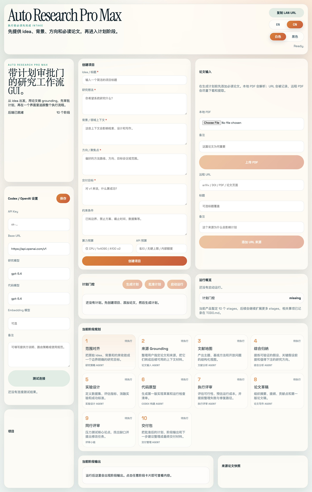

<p align="center">
  
</p>

<h1 align="center">Auto Research Pro Max</h1>

<p align="center">
  <a href="https://jacktheranger.github.io/Auto-Research-Pro-Max">
    
  </a>
</p>

<p align="center">
  <a href="#english">English</a> | <a href="#中文">中文</a>
</p>

---

## English

Auto Research Pro Max is an autonomous workbench that takes you from initial idea to a complete paper manuscript. Provide relevant information and literature, review AI-generated plans, and let the AI autonomously design and validate experiments in a local sandbox, generating a complete manuscript with just one click. Instead of a black-box agent run, it provides a plan-gated workflow where retrieval, sandboxing, and approval loops are transparent and fully controlled.

## Demo



## What It Does

- Collect a mandatory project brief before execution: title, idea, background, direction, goals, constraints, and must-read papers.
- Combine local PDF uploads and remote paper URLs in the same project workspace.
- Enrich paper records with DOI, venue, year, author lists, citation keys, preview thumbnails, and first-page renders.
- Chunk attached papers for paper-grounded retrieval, with embedding-backed ranking when an embedding model is configured.
- Generate a research plan first, then require explicit approval before any run starts.
- Configure a local repository path or git URL plus setup/run commands for repository-aware sandbox execution.
- Execute the current staged workflow with live stage tracking and persisted outputs.
- Export final manuscript assets as `Markdown`, `LaTeX`, `BibTeX`, compiled `PDF`, and a zipped delivery bundle.
- Run bibliography generation, citation verification, claim-evidence consistency checks, and venue-specific peer-review rubrics during the writing tail of the pipeline.
- Configure [OpenAI](https://platform.openai.com/) / [Codex-compatible](https://platform.openai.com/docs) settings and test the connection from the GUI.
- Review papers, plans, runs, and stage outputs in one modern web dashboard.
- Share the app over LAN for demos, reviews, or screenshots from another device.

## Current Stage Plan

The current product runs a fixed 15-stage pipeline plus a planning gate, with explicit approval gates around experiment design, sandbox review, and manuscript revision. Per-project stage customization, branching, and richer retry policies are still future work.

## Requirements

- `macOS` for the current one-click launcher flow
- `Python 3.11+`
- `Node.js 18+` and `npm`
- internet access on first launch so Python and frontend dependencies can be installed
- an OpenAI-compatible API key if you want live model outputs instead of local fallback outputs
- optional: `Docker` if you want the experiment sandbox stage to execute real repository commands
- optional: `tesseract` plus the `[ocr]` extras (`pip install -e ".[ocr]"`) if you want PDF OCR fallback for scanned papers

Windows one-click support: Coming Soon.

## Stack

- Backend: [FastAPI](https://fastapi.tiangolo.com/), [SQLite](https://www.sqlite.org/), [OpenAI Python SDK](https://github.com/openai/openai-python), [pypdf](https://pypdf.readthedocs.io/), [PyMuPDF](https://pymupdf.readthedocs.io/), [ReportLab](https://www.reportlab.com/dev/docs/)
- Frontend: [React](https://react.dev/), [TypeScript](https://www.typescriptlang.org/), [Vite](https://vite.dev/)

## One-click Start

On macOS, double-click [`start.command`](start.command).

Before using the one-click launcher, make sure you have:

- `Python 3.11+`
- `Node.js 18+` and `npm` available in your shell `PATH`
- internet access on first launch so dependencies can be installed
- optional: an OpenAI-compatible API key for live model-backed planning and stage generation
- optional: `Docker` if you want the experiment sandbox stage to execute repository setup and benchmark commands

Windows one-click support: Coming Soon.

That launcher will:

- create `.venv` if needed
- install backend dependencies
- install frontend dependencies if missing
- build the frontend bundle
- start the backend on [http://127.0.0.1:8000](http://127.0.0.1:8000)
- open the app in your browser

To stop the background server later, double-click [`stop.command`](stop.command).

If no API key is configured, the app still runs with deterministic fallback outputs so the GUI and workflow remain usable.

## LAN Sharing

If you want to open the app from another device on the same local network, double-click [`start-lan.command`](start-lan.command).

That mode binds the server to `0.0.0.0` and prints one or more `LAN URL` addresses in the terminal window. Open one of those URLs from your PC browser.

If your Mac prompts for firewall access, allow it or the PC may not be able to connect.

## Manual Run

### 1. Backend

```bash
python3 -m venv .venv
source .venv/bin/activate
python3 -m pip install -e .
uvicorn backend.app.main:app --reload
```

The backend starts on [http://127.0.0.1:8000](http://127.0.0.1:8000).

### 2. Frontend

In another terminal:

```bash
cd frontend
npm install
npm run dev
```

The frontend starts on [http://127.0.0.1:5173](http://127.0.0.1:5173).

## Current Workflow

1. Configure API settings.
2. Create a project with title, idea, background, direction, goals, and constraints.
3. Attach must-read papers through local PDF upload, remote URLs, or live literature search import.
4. Generate the plan, review it, and explicitly approve it.
5. Start the staged pipeline and watch stage output update live.
6. Use pause, resume, reject, and rollback controls when a run reaches an approval gate.

## Privacy And Local-first Behavior

- Project metadata, plans, run state, stage outputs, and settings are stored locally in `backend/data/app.db`.
- Uploaded PDFs are stored locally in [`backend/data/uploads/`](backend/data/uploads/).
- Remote paper URLs are fetched over the network when you add them, and remote PDFs are downloaded locally when possible.
- If an API key is configured, project context, paper snippets, approved plans, and prior stage outputs are sent to the configured model endpoint.
- If no API key is configured, the app uses local fallback outputs and does not make model API calls.
- API settings are currently stored locally in SQLite for convenience in this prototype; there is no separate secrets vault yet.

## Architecture

- [`frontend/`](frontend) contains the React + TypeScript + Vite web UI.
- [`backend/app/`](backend/app) contains the FastAPI API, project state endpoints, plan generation, and run orchestration.
- [`backend/data/`](backend/data) holds the local SQLite database and uploaded paper files.
- [`launcher.py`](launcher.py) and the `*.command` scripts provide one-click local and LAN startup flows.
- WebSocket updates stream run progress to the GUI while stages are executing.

## Current Limitations

- The stage list is fixed today; per-project stage customization, branching, and retry playbooks are not implemented yet.
- PDF previews depend on the optional local PyMuPDF dependency, and embedding-backed retrieval depends on a configured embedding model.
- Repository-aware sandbox execution requires Docker plus an explicit repo path or git URL and setup/run commands.
- The current sandbox runtime preinstalls an allowlisted Python stack; broader dependency bootstrapping and recovery controls are still future work.
- Windows one-click startup is not available yet.

## Roadmap

- Add OCR fallback and manual metadata repair workflows for scanned or partially parsed papers.
- Add stronger recovery controls and broader dependency/bootstrap options for repository-aware sandbox runs.
- Add branching, per-stage retry policies, cost tracking, and project templates.
- Add first-class Windows support, including one-click start/stop scripts and packaging.

More planned work is tracked in [`TODO.md`](TODO.md).

## FAQ / Troubleshooting

- `python3: command not found`
  Install Python `3.11+` and make sure `python3` is available in your shell.
- `npm: command not found`
  Install `Node.js` so both `node` and `npm` are available in your shell.
- The first launch feels slow
  The launcher may be creating `.venv`, installing Python packages, installing frontend dependencies, and building the frontend bundle.
- My PC cannot open the app over the network
  Start with [`start-lan.command`](start-lan.command), make sure both devices are on the same LAN, and allow macOS firewall access if prompted.
- I did not configure an API key
  That is supported. The app will still run, but plan and stage outputs will use deterministic local fallback content instead of live model calls.

## License

This project is licensed under [`AGPL-3.0`](LICENSE). If you modify the software and provide it over a network, the corresponding source code obligations still apply.

## Contributing

Issues and focused pull requests are welcome. For larger workflow or architecture changes, open an issue first so the stage model, UI flow, and product direction can be aligned before implementation.

---

## 中文

Auto Research Pro Max 从一个想法出发，给出相关的信息与文献，审阅 AI 给出的计划，AI 会通过自动本地沙箱环境自动化设计并验证研究方案，最终一键生成完整的论文手稿。与黑盒 Agent 不同，它提供了一个规划导向的工作流，让检索、沙箱实验和人工审批回路变得清晰可见且全程可控。

## 演示



## 功能简介

- 在执行前强制收集完整项目简报：标题、想法、背景、方向、目标、约束条件以及必读论文。
- 在同一个项目工作区中同时接收本地 PDF 上传和远程论文链接。
- 自动补齐论文 DOI、venue、年份、作者列表、citation key，并生成缩略图与首页预览。
- 对论文内容做 chunking 用于 grounded retrieval；如果配置了 embedding 模型，会自动启用向量排序。
- 先生成研究计划，再要求用户显式批准，之后才会开始执行。
- 可为实验沙箱配置本地仓库路径或 git URL，再提供 setup/run 命令来执行真实仓库工作负载。
- 按当前分阶段流程执行任务，并实时显示阶段进度和持久化输出。
- 在写作阶段尾部生成真实的 `Markdown`、`LaTeX`、`BibTeX`、编译后 `PDF` 以及 zip 交付包。
- 在导出与评审阶段执行参考文献生成、引文校验、claim-evidence 一致性检查，以及面向不同 venue 的 rubric 评审。
- 在图形界面中配置 [OpenAI](https://platform.openai.com/) / [Codex 兼容](https://platform.openai.com/docs) 设置，并测试连接是否可用。
- 在一个现代化 Web 仪表盘中统一查看论文、计划、运行记录和阶段输出。
- 支持通过局域网共享，方便演示、审阅，或从其他设备打开界面截图。

## 当前阶段规划

当前产品采用固定的 15 阶段流程加一个前置计划审批，并在实验设计、沙箱评审和论文修订处设置了显式审批门。按项目自定义阶段列表、分支对比和更丰富的重试策略仍然是后续工作。

## 环境要求

- 当前一键启动流程需要 `macOS`
- `Python 3.11+`
- `Node.js 18+` 和 `npm`
- 首次启动时需要联网，以安装 Python 和前端依赖
- 如果你希望使用真实模型输出，而不是本地回退内容，需要提供兼容 OpenAI 的 API Key
- 如果你希望实验沙箱阶段执行真实仓库命令，可额外安装 `Docker`
- 如果你希望对扫描版 PDF 启用 OCR 回退，可选安装 `tesseract` 以及 `[ocr]` 可选依赖（`pip install -e ".[ocr]"`)

Windows 一键启动支持：Coming Soon.

## 技术栈

- 后端：[FastAPI](https://fastapi.tiangolo.com/)、[SQLite](https://www.sqlite.org/)、[OpenAI Python SDK](https://github.com/openai/openai-python)、[pypdf](https://pypdf.readthedocs.io/)、[PyMuPDF](https://pymupdf.readthedocs.io/)、[ReportLab](https://www.reportlab.com/dev/docs/)
- 前端：[React](https://react.dev/)、[TypeScript](https://www.typescriptlang.org/)、[Vite](https://vite.dev/)

## 一键启动

在 macOS 上，直接双击 [`start.command`](start.command)。

在使用一键启动器前，请先确认：

- 已安装 `Python 3.11+`
- `Node.js 18+` 和 `npm` 已经在你的 shell `PATH` 中可用
- 首次启动时可以联网安装依赖
- 可选：如果你希望使用真实模型规划和阶段生成，可配置兼容 OpenAI 的 API Key
- 可选：如果你希望实验沙箱阶段执行仓库准备命令和 benchmark 命令，可安装 `Docker`

Windows 一键启动支持：Coming Soon.

这个启动器会：

- 按需创建 `.venv`
- 安装后端依赖
- 如果缺失则安装前端依赖
- 构建前端 bundle
- 在 [http://127.0.0.1:8000](http://127.0.0.1:8000) 启动后端
- 自动在浏览器中打开应用

如果之后需要停止后台服务，双击 [`stop.command`](stop.command) 即可。

如果没有配置 API Key，应用仍然可以运行，只是会使用确定性的本地回退输出，以保证界面和流程仍然可用。

## 局域网共享

如果你想从同一局域网中的其他设备访问应用，双击 [`start-lan.command`](start-lan.command)。

这个模式会把服务绑定到 `0.0.0.0`，并在终端窗口中打印一个或多个 `LAN URL` 地址。你可以在其他电脑的浏览器里打开这些地址。

如果 macOS 弹出防火墙访问提示，请允许，否则其他设备可能无法连接。

## 手动运行

### 1. 后端

```bash
python3 -m venv .venv
source .venv/bin/activate
python3 -m pip install -e .
uvicorn backend.app.main:app --reload
```

后端会启动在 [http://127.0.0.1:8000](http://127.0.0.1:8000)。

### 2. 前端

在另一个终端中执行：

```bash
cd frontend
npm install
npm run dev
```

前端会启动在 [http://127.0.0.1:5173](http://127.0.0.1:5173)。

## 当前工作流

1. 配置 API 设置。
2. 创建项目，并填写标题、想法、背景、方向、目标和约束。
3. 通过本地 PDF、远程链接或实时文献检索导入必读论文。
4. 生成计划，审阅后明确批准。
5. 启动分阶段流程，并实时查看阶段输出更新。
6. 当运行到审批门时，可使用暂停、恢复、拒绝和回滚控制。

## 隐私与本地优先行为

- 项目元数据、计划、运行状态、阶段输出和设置都保存在本地的 `backend/data/app.db` 中。
- 上传的 PDF 文件保存在本地的 [`backend/data/uploads/`](backend/data/uploads/) 中。
- 当你添加远程论文链接时，应用会通过网络抓取链接内容，并在可能的情况下把远程 PDF 下载到本地。
- 如果配置了 API Key，项目上下文、论文片段、已批准计划和前序阶段输出会发送到你配置的模型接口。
- 如果没有配置 API Key，应用会使用本地回退输出，并且不会发起模型 API 调用。
- 当前原型为了方便，API 设置保存在本地 SQLite 中；暂时还没有单独的密钥保险库。

## 架构

- [`frontend/`](frontend) 包含基于 React + TypeScript + Vite 的 Web 界面。
- [`backend/app/`](backend/app) 包含 FastAPI API、项目状态接口、计划生成逻辑和运行编排逻辑。
- [`backend/data/`](backend/data) 存放本地 SQLite 数据库和上传的论文文件。
- [`launcher.py`](launcher.py) 与各个 `*.command` 脚本提供本地和局域网的一键启动流程。
- 在阶段执行期间，WebSocket 更新会把运行进度实时推送到界面。

## 当前限制

- 当前阶段列表仍是固定配置，尚不支持按项目自定义、分支对比或阶段重试策略。
- PDF 预览依赖本地可用的 PyMuPDF，embedding 驱动的 grounded retrieval 则依赖已配置的 embedding 模型。
- 仓库感知的实验沙箱执行依赖 Docker，以及明确配置的 repo 路径或 git URL 和 setup/run 命令。
- 当前沙箱 runtime 预装的是白名单 Python 依赖；更广泛的依赖引导和恢复控制仍属于后续工作。
- Windows 一键启动目前还不可用。

## 路线图

- 增加针对扫描版或解析不完整论文的 OCR 回退与手工 metadata 修正流程。
- 为仓库感知的 sandbox 运行补充更强的恢复控制，以及更广泛的依赖/bootstrap 选项。
- 增加分支对比、阶段重试策略、成本跟踪和项目模板。
- 增加完整的 Windows 支持，包括一键启动/停止脚本和打包能力。

更多计划中的工作见 [`TODO.md`](TODO.md)。

## FAQ / 故障排查

- `python3: command not found`
  请安装 Python `3.11+`，并确认 `python3` 在你的 shell 中可用。
- `npm: command not found`
  请安装 `Node.js`，确保 `node` 和 `npm` 都能在你的 shell 中使用。
- 第一次启动感觉比较慢
  启动器可能正在创建 `.venv`、安装 Python 包、安装前端依赖并构建前端 bundle。
- 其他电脑无法通过网络打开应用
  请使用 [`start-lan.command`](start-lan.command)，确认两台设备在同一个局域网内，并在 macOS 弹出防火墙提示时选择允许。
- 我没有配置 API Key
  这是支持的。应用仍然可以运行，只是计划和阶段输出会改用确定性的本地回退内容，而不是实时模型调用。

## 许可证

本项目采用 [`AGPL-3.0`](LICENSE) 许可证。如果你修改了本软件并通过网络提供服务，仍需遵守对应的源代码公开义务。

## 贡献

欢迎提交 issue 和聚焦明确的 pull request。对于较大的工作流或架构变更，建议先开 issue，以便先对阶段模型、界面流程和产品方向达成一致。

---

<p align="center"><a href="#top">Back to Top</a></p>
