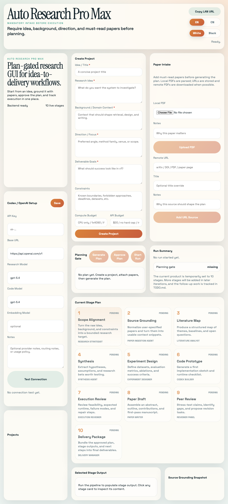

# Auto Research Pro Max

A local-first GUI for idea-to-paper research workflows. This version focuses on the core product loop:



- mandatory project intake before execution
- local and remote paper sources
- plan generation plus explicit user approval
- reduced live pipeline with stage tracking
- OpenAI/Codex settings and connection testing
- modern web GUI for monitoring outputs

## Current Stage Plan

The current product is temporarily set to 10 stages plus a planning gate. More stages will be added in later iterations as the workflow, retrieval stack, and execution system become more complete.

## Stack

- Backend: `FastAPI`, `SQLite`, `OpenAI Python SDK`, `pypdf`
- Frontend: `React`, `TypeScript`, `Vite`

## One-click start

On macOS, double-click [`start.command`](start.command).

That launcher will:

- create `.venv` if needed
- install backend dependencies
- install frontend dependencies if missing
- build the frontend bundle
- start the backend on `http://127.0.0.1:8000`
- open the app in your browser

To stop the background server later, double-click [`stop.command`](stop.command).

## LAN sharing

If you want to open the app from another device on the same local network, double-click [`start-lan.command`](start-lan.command).

That mode binds the server to `0.0.0.0` and prints one or more `LAN URL` addresses in the terminal window. Open one of those URLs from your PC browser.

If your Mac prompts for firewall access, allow it or the PC may not be able to connect.

## Manual run

### 1. Backend

```bash
python3 -m venv .venv
source .venv/bin/activate
python3 -m pip install -e .
uvicorn backend.app.main:app --reload
```

The backend starts on `http://127.0.0.1:8000`.

### 2. Frontend

In another terminal:

```bash
cd frontend
npm install
npm run dev
```

The frontend starts on `http://127.0.0.1:5173`.

## Current v1 flow

1. Configure API settings.
2. Create a project with title, idea, background, direction, goals, and constraints.
3. Attach must-read papers through local PDF upload or remote URLs.
4. Generate the plan.
5. Review and approve the plan.
6. Start the reduced pipeline and watch stage output update live.

## Notes

- If no API key is configured, the app still works with deterministic fallback outputs.
- Local PDFs are parsed with `pypdf`.
- Remote PDF URLs are downloaded and parsed when possible. Non-PDF URLs are stored as grounded sources without extraction.
- Remaining advanced capabilities are listed in [`TODO.md`](TODO.md).
